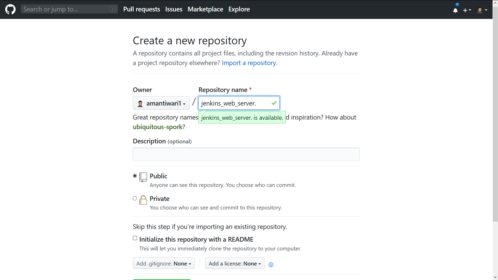
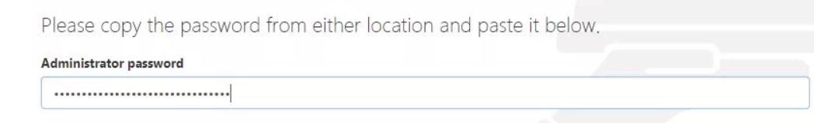
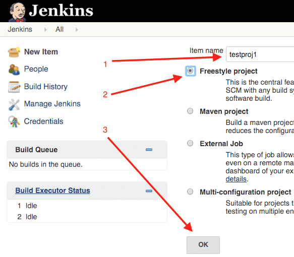
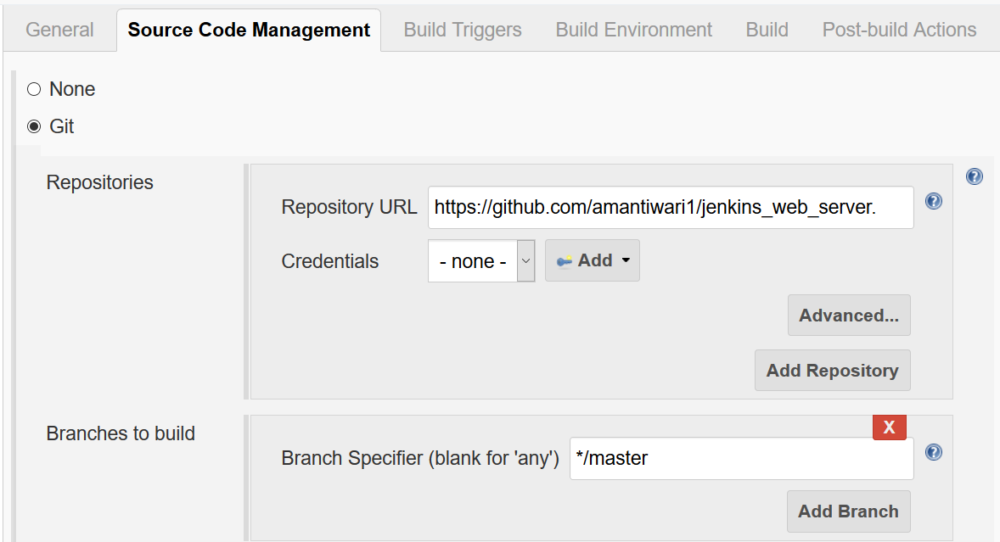
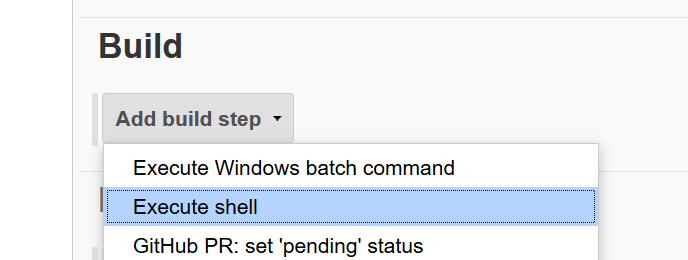

### how to install Git, Jenkins and Docker in Redhat 8

---

## Git Setup

###### you have to download git software below and Install it

###### Windows

[Install Git in Windows](<https://git-scm.com/download/win>)

###### MacOS

[Install Git in MacOS](<https://git-scm.com/download/mac>)

### Redhat 8

```bash
yum install git -y
```

If not Working

```bash
wget https://github.com/git/git/archive/v2.10.1.tar.gz -O git.tar.gz
tar -zxf git.tar.gz
cd git-2.10.1/
make configure
./configure --prefix=/usr/local
make install
```

---

## Jenkins Setup in RedHat 8

### Note : only Works in Redhat

### Download repo file and Import to /etc/yum.repos.d

```bash
sudo wget -O /etc/yum.repos.d/jenkins.repo https://pkg.jenkins.io/redhat-stable/jenkins.repo
sudo rpm --import https://pkg.jenkins.io/redhat-stable/jenkins.io.key
```

Install jenkins

```bash
yum install jenkins -y
```

Install openjdk by jenkins

```bash
yum install java-11-openjdk -y
```

---

## Docker Setup in Redhat 8

### Step by Step

Go to yum.repos.d

```bash
cd /etc/yum.repos.d
```

make new file 'dokcer.repo'

```bash
vim docker.repo
```

### or

```bash
gedit docker.repo
```

type it in docker.repo

```bash
[docker]
baseurl = https://download.docker.com/linux/centos/7/x86_64/stable/
gpgcheck=0
```

install docker

```bash
yum install docker-ce -y --nobest
```


## Get Start Together Git, Docker, and Jenkins!!

### Create New Github Account

[Git Account Sign up](<https://github.com/join>)

### Create New repository in github

[Create repository](<https://github.com/new>)



#### Step 1 : Type Name repository.

#### Step 2 : Create repository


#### Step 3 : Go To Command/Terminal/ Git Bash

#### Step 4 : Go to login in Command First Below

```bash
$ git config --global user.name "myname"
$ git config --global user.email myemail@example.com
```

Note : It will ask you password itself!!! for security reasons!

#### Step 5 : Create folder , Create new Html File , Add remote from Github Repository

```bash
$ # create folder
$ mkdir jenkins_web_jenkins

$ # change dir
$ cd jenkins_web_jenkins

$ # make new html file, write and save it
$ notepad index.html

$ # Create git project
$ git init

$ # add all files in staging area
$ git add .

$ # commit messages
$ git commit . -m 'first commit'

$ # add remote where to push to github url
$ git remote add origin https://github.com/amantiwari1/jenkins_web_server..git

$ # upload all files to github website using name which add earlier url 
$ git push -u origin master
```

---

## Switch to Jenkins !!

start service in rhel 8

```bash
$ systemctl start jenkins
```

find ip address using command

```bash
$ ifconfig
```

it is my ip is 192.168.42.164

go to jenkins website

http://192.168.42.164:8080

Note: Port iis 8080 otherwise Not working!!

it will ask you password

```bash
$ sudo cat /var/lib/jenkins/secrets/initialAdminPassword
435jwhwj4h5jhw3j5hesh45jhw34ehre
```



go to Manage Jenkins > Manage Users > setting logo > password

change password

go to DeshBoard

go to Manage Jenkins > Manage Plugins > Available

search 'github'

tap tick it


tap 'Download now and install after restart'

go to DeshBoard

tap Create New jobs

type 'web1'

tap Freestyle project and ok





go to Source Code Management and tick git

copy and paste from github url : [https://github.com/amantiwari1/jenkins\_web\_server..git](<https://github.com/amantiwari1/jenkins_web_server..git>)



go to build and add execute shell



type 'sudo cp -vrf \* /web'

save it

---

## Switch to Docker !!!

Disable Linux Security

```bash
$ setenforce 0
```

Docker start in service

```bash
$ systemctl start docker
```

docker download new image 'httpd' for web server

```bash
$ docker pull httpd
```

launch httpd with port !!

```bash
$ cd web1
$ docker run -dit --name web1 -p 8081:80 -v "$PWD":/usr/local/apache2/htdocs/ httpd
```

go to [http://192.168.42.164:8081](<http://192.168.42.164:8081/>)

check if it is working!!

---

## Switch to Jenkins!!

go to [http://192.168.42.164:8080](<http://192.168.42.164:8080/>)

go to web1 in job

build now if you changed in some file


